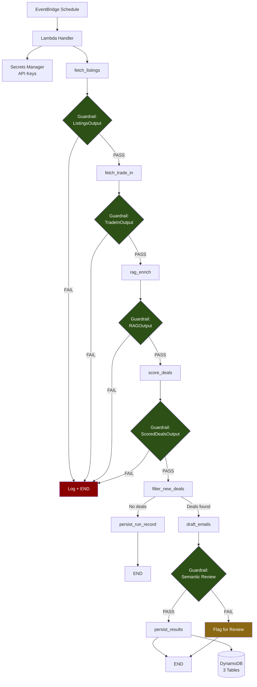

# Lookout

An agentic AI system that monitors markets (currently the electric vehicle market) for exceptional deals, scores them against a configurable preference profile, and drafts dealership outreach emails for human review.

Built with production-grade patterns: structural guardrails at every node boundary, a model-agnostic LLM abstraction layer, OIDC-federated CI/CD, and infrastructure defined entirely in AWS CDK.

---

## Architecture



## Key Design Decisions

| Decision | Rationale | ADR |
|---|---|---|
| LangGraph over Bedrock Agents | Explicit graph, inter-node guardrails, local testability | [001](docs/decisions/001-langgraph-over-bedrock-agents.md) |
| Three DynamoDB tables | Schema clarity, independent scaling, simpler IAM | [002](docs/decisions/002-dynamodb-schema-design.md) |
| Pydantic guardrails per node | Fail-fast, auditable, schema-as-documentation | [003](docs/decisions/003-pydantic-guardrails-per-node.md) |
| OIDC over static credentials | No long-lived secrets, audit trail, compliance alignment | [004](docs/decisions/004-oidc-over-static-credentials.md) |
| Model-agnostic LLM abstraction | Cost optimization, vendor risk, capability experimentation | [005](docs/decisions/005-model-agnostic-abstraction.md) |
| Human-in-the-loop email boundary | Trust boundary, legal protection, responsible AI | [006](docs/decisions/006-hitl-email-boundary.md) |

## Stack

- **Python 3.12** — runtime
- **LangGraph** — agent orchestration
- **Pydantic v2** — structural guardrails and data models
- **AWS CDK** — all infrastructure as code
- **DynamoDB** — audit logs, deal history, trade-in time series
- **Playwright** — web scraping with fixture fallback
- **FAISS** — local vector index for RAG
- **GitHub Actions** — CI/CD with OIDC federation

## Getting Started

### Prerequisites

- Python 3.12+
- Node.js 20+ (for CDK CLI)
- AWS account with CDK bootstrapped

### Setup

```bash
# Clone and install
git clone <repo-url> && cd lookout
python -m venv .venv && source .venv/bin/activate
make install

# Run the eval suite (no AWS or API keys needed)
make eval

# Synthesize CDK stacks
make synth
```

### Configuration

Edit `src/config/preferences.yaml` to set your vehicle, location, and deal criteria:

```yaml
vehicle:
  vin: "YOUR_VIN"
  mileage: 50000
  condition: "good"
  trade_in_floor_usd: 18000

search:
  location_zip: "10001"
  radius_miles: 75

deal_criteria:
  max_effective_monthly_usd: 450
  acceptable_apr_max: 2.9
  zero_percent_financing_preferred: true

scoring:
  threshold_notify: 0.75
  threshold_draft_email: 0.80
```

### Deployment

```bash
# Deploy dev (TEST_MODE=true, fixtures, RemovalPolicy.DESTROY)
make deploy-dev

# Deploy prod (requires manual approval in GitHub)
git push origin main   # triggers CI/CD pipeline
```

### Operations

```bash
# Pause the agent (disables schedule + sets concurrency to 0)
make pause

# Resume
make resume
```

## Sample Run Output

```json
{
  "run_id": "a1b2c3d4-e5f6-7890-abcd-ef1234567890",
  "status": "SUCCESS",
  "environment": "dev",
  "nodes_executed": [
    {"node": "fetch_listings", "output_record_count": 12, "guardrail_result": "PASS"},
    {"node": "fetch_trade_in", "output_record_count": 1, "guardrail_result": "PASS"},
    {"node": "rag_enrich", "output_record_count": 5, "guardrail_result": "PASS"},
    {"node": "score_deals", "output_record_count": 12, "guardrail_result": "PASS"},
    {"node": "filter_new_deals", "output_record_count": 3, "guardrail_result": "EXEMPT"},
    {"node": "draft_emails", "output_record_count": 1, "guardrail_result": "PASS"},
    {"node": "persist_results", "output_record_count": 4, "guardrail_result": "PASS"}
  ],
  "deals_found": 12,
  "deals_above_threshold": 3,
  "drafts_produced": 1,
  "guardrail_triggers": []
}
```

### Sample Scored Deal

```json
{
  "listing_id": "LST-001",
  "make": "Chevrolet",
  "model": "Equinox EV",
  "year": 2025,
  "overall_score": 0.92,
  "score_breakdown": {
    "price_score": 0.95,
    "financing_score": 1.0,
    "incentive_score": 0.85,
    "preference_match_score": 0.88,
    "reasoning": "Excellent deal: 10% below MSRP with 0% APR financing. Eligible for federal tax credit."
  },
  "effective_out_of_pocket_usd": 4000.0,
  "trade_in_value_at_scoring": 20000.0,
  "applicable_incentives": ["Federal EV Tax Credit $7,500", "DE Clean Vehicle Rebate $2,500"]
}
```

### Sample Draft Email

> **Subject:** Inquiry about 2025 Chevrolet Equinox EV
>
> Hello,
>
> I am writing to express my interest in the 2025 Chevrolet Equinox EV currently listed on your website. I have a vehicle to trade in and would appreciate the opportunity to discuss available financing options and any current manufacturer incentives.
>
> Could you please provide information on:
> - Current financing rates and any 0% APR promotions
> - Your trade-in evaluation process
> - Any additional manufacturer rebates or incentives
>
> I am flexible on timing and happy to schedule at your convenience.
>
> Thank you for your time.

## Eval Suite

```bash
# Run all evals (structural + scoring + semantic + e2e)
make eval

# 61 tests across 7 test files:
# - test_guardrails.py      — Pydantic model validation (25 tests)
# - test_deduplication.py    — Listing dedup logic (3 tests)
# - test_preferences_loader.py — YAML config validation (5 tests)
# - test_scoring.py          — Score range assertions (7 tests)
# - test_email_drafts.py     — Draft quality + compliance (8 tests)
# - test_semantic_guardrail.py — LLM-as-judge contract (5 tests)
# - test_full_run.py         — End-to-end graph execution (7 tests)
```

## Project Structure

```
lookout/
├── infrastructure/          # AWS CDK stacks (agent + monitoring)
│   ├── config.py            # Dev/prod environment config
│   ├── stacks/              # AgentStack, MonitoringStack
│   └── constructs/          # Reusable Lambda construct
├── src/
│   ├── agent/               # LangGraph graph + nodes
│   ├── guardrails/          # Pydantic structural + semantic guardrails
│   ├── llm/                 # Model-agnostic provider + secrets
│   ├── tools/               # Scrapers, trade-in, email drafter
│   ├── rag/                 # FAISS indexer + retriever + source docs
│   ├── memory/              # DynamoDB stores (runs, deals, trade-in)
│   └── config/              # User preferences (YAML)
├── evals/                   # 61 tests across 7 files
├── docs/                    # Architecture doc + 6 ADRs
├── scripts/                 # pause.sh, resume.sh, assert_response.py
└── .github/workflows/       # OIDC-federated CI/CD pipeline
```

## Non-Negotiable Standards

- No `*` in any IAM policy — every permission names explicit ARNs
- No secrets in code or env vars — Secrets Manager only
- No long-lived AWS credentials — OIDC federation only
- No node output reaches the next node without passing its Pydantic guardrail
- No email is ever sent by the agent — drafts only, human review required
- All LLM calls specify `max_tokens` and `temperature` explicitly
- `TEST_MODE=true` disables all real scraping and external calls

## License

Private — portfolio project.
